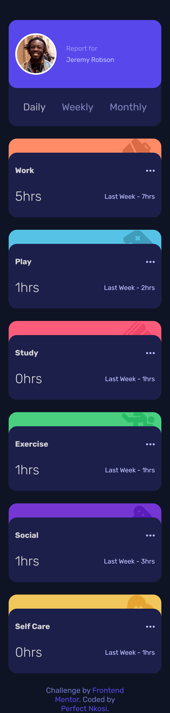
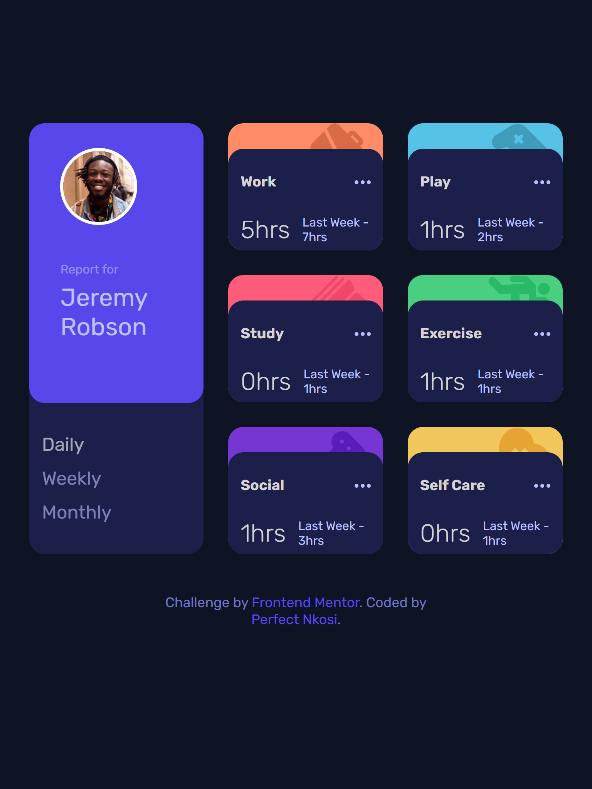
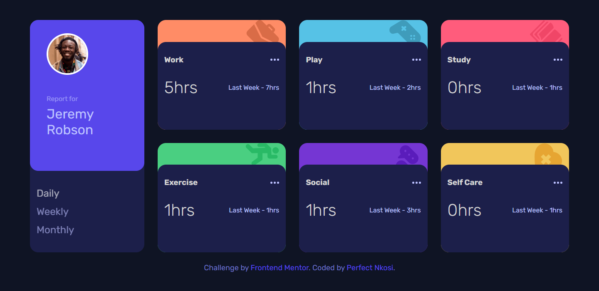

# Frontend Mentor - Time tracking dashboard solution

This is a solution to the [Time tracking dashboard challenge on Frontend Mentor](https://www.frontendmentor.io/challenges/time-tracking-dashboard-UIQ7167Jw). Frontend Mentor challenges help you improve your coding skills by building realistic projects.

## Table of contents

- [Frontend Mentor - Time tracking dashboard solution](#frontend-mentor---time-tracking-dashboard-solution)
  - [Table of contents](#table-of-contents)
  - [Overview](#overview)
    - [The challenge](#the-challenge)
    - [Screenshot](#screenshot)
      - [Mobile](#mobile)
      - [Tablet](#tablet)
      - [Desktop](#desktop)
    - [Links](#links)
  - [My process](#my-process)
    - [Built with](#built-with)
    - [What I learned](#what-i-learned)
    - [Continued development](#continued-development)
  - [Author](#author)

## Overview

### The challenge

Users should be able to:

- View the optimal layout for the site depending on their device's screen size
- See hover states for all interactive elements on the page
- Switch between viewing Daily, Weekly, and Monthly stats

### Screenshot

#### Mobile



#### Tablet



#### Desktop



### Links

- Solution URL: [Add solution URL here](https://your-solution-url.com)
- Live Site URL: [Add live site URL here](https://your-live-site-url.com)

## My process

### Built with

- Semantic HTML5 markup
- CSS custom properties
- CSS variables
- Flexbox
- CSS Grid
- Mobile-first workflow
- [React](https://reactjs.org/) - JS library
- [Styled Components](https://styled-components.com/) - For styles

### What I learned

I recently started learning React Js and thought that this challenge would be a great opportunity to apply the concepts I have learned so far. Currenly I have been learning about react components and props, creating reusable components by passing data to them. This challenge helped me to learn more about props through the data I passed to the card component.

To work with the provided data, I created a function that will return all the information for a given timeframe (Daily, Weekly, or Monthly) and return that data as an array of objects

```js
import data from './data'

const getCards = (timeframeRequested) => {
  let counter = 1
  const cards = data.map((item) => {
    if (item.timeframes[timeframeRequested]) {
      const title = item.title.toLowerCase().replace(' ', '-')
      return {
        id: counter++,
        title: item.title,
        hours: item.timeframes[timeframeRequested],
        iconURL: `/src/assets/icon-${title}.svg`,
        bgColor: `${title}-card-bg`,
      }
    }
  })
  return cards
}

export default getCards
}
```

### Continued development

In the future I want to learn how to work with JSON files. I struggled to use the data.json file provided and I had to change the file to a javascript file. This made me realise that I should also do a deep dive on asynchronise programming

More especially on these topics:

- Promises
- Async / Await

## Author

- Github - [Perfect Nkosi](https://github.com/PNkosi)
- Frontend Mentor - [@yourusername](https://www.frontendmentor.io/profile/yourusername)
- Twitter - [@yourusername](https://www.twitter.com/yourusername)
